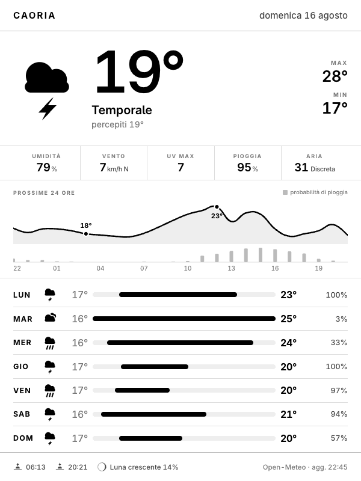

# k4-weather

Dashboard meteo per **Kindle 4 non-touch jailbroken**: GitHub Actions genera
ogni 30 minuti un PNG 600×800 in scala di grigi partendo dalle API di
[Open-Meteo](https://open-meteo.com), il Kindle lo scarica e lo mostra con
`eips`. Nessun server da mantenere.



## Come funziona

```
GitHub Actions (ogni 30 min)                       Kindle 4 (ogni 30 min)
──────────────────────────────                     ──────────────────────
Open-Meteo  ─►  modello dati                       sveglia da RTC
                    │                                    │
                    ▼                              attende il wifi
             HTML + CSS + SVG                            │
                    │                                    ▼
                    ▼                              xh get dashboard.png
          Chromium headless (screenshot)                 │
                    │                                    ▼
                    ▼                              eips -g dashboard.png
      grigio 8 bit, 16 livelli, 600×800                  │
                    │                                    ▼
                    ▼                              suspend to RAM
        branch `output` ─► GitHub Pages ───────────────►
```

Il Kindle resta volutamente stupido: scarica un'immagine e la disegna. Tutta
la logica sta in CI, dove e' facile testarla e vederla nel browser.

## Cosa mostra

- **Adesso**: temperatura, condizione, percepita, massima e minima di oggi
- **Striscia metriche**: umidita, vento con direzione, UV massimo, probabilita
  di pioggia, qualita dell'aria (indice EAQI europeo)
- **Prossime 24 ore**: andamento della temperatura con minimo e massimo
  annotati, barre di probabilita di pioggia
- **7 giorni**: icona, escursione min–max su una **scala comune** — l'andamento
  della settimana si legge dalla posizione delle barre, senza leggere i numeri
- **Piede**: alba, tramonto, fase lunare con percentuale di illuminazione, ora
  di generazione

## Sviluppo

```sh
make setup      # virtualenv + dipendenze + Chromium
make preview    # genera out/dashboard.png dalla fixture, senza rete
make generate   # come sopra ma con i dati veri
make icons      # provino di tutte le icone alle dimensioni reali
make test
```

`make preview` scrive anche `out/dashboard.html`: e' un file autoconsistente
(font in base64, icone SVG inline) che si apre direttamente nel browser. E' il
modo veloce per iterare sul design — si modifica il CSS e si ricarica, senza
passare dal rendering.

Le fixture in `tests/fixtures/` sono risposte reali di Open-Meteo, cosi'
l'anteprima e i test sono riproducibili e non dipendono dalla rete.

### Struttura

| Percorso | Ruolo |
|---|---|
| `src/k4weather/fetch.py` | client Open-Meteo (previsioni + qualita dell'aria) |
| `src/k4weather/model.py` | normalizzazione dati e geometria dei grafici |
| `src/k4weather/wmo.py` | codici meteo WMO → descrizione italiana + icona |
| `src/k4weather/astro.py` | fase lunare, rosa dei venti |
| `src/k4weather/render.py` | template Jinja → HTML → screenshot Chromium |
| `src/k4weather/postprocess.py` | conversione e validazione per `eips` |
| `src/k4weather/templates/` | HTML, CSS, icone SVG, font Inter |
| `kindle/` | configurazione per il client sul dispositivo |

## Vincoli del Kindle 4 che spiegano le scelte

| Vincolo | Conseguenza nel progetto |
|---|---|
| Pannello 600×800, 16 livelli di grigio | Palette limitata a multipli di 17, cosi' le campiture non perdono nulla in quantizzazione |
| `eips` deforma i PNG RGB | `postprocess.py` forza grayscale 8 bit senza alpha, e `make inspect` lo verifica |
| Tratti sottili e grigi chiari spariscono a 167 ppi | Icone a forme piene, filetti mai sotto 1 px, testo nero pieno |
| curl/wget di serie non parlano TLS moderno | Il download usa `xh`, il client statico incluso in kindle-dash |
| Il cron di GitHub Actions ritarda di 5-20 minuti | Il Kindle si sveglia sfasato di 15 minuti e l'immagine porta sempre l'ora di generazione |

### Icone

Set monocromatico disegnato per questo schermo, in `templates/icons/`.
Geometria condivisa su viewBox 64×64:

```
nuvola canonica   circle(25,28,13) circle(41,31.5,10) rect(11,33,42,11,r5.5)   y 15..44
nuvola alta       la stessa traslata di -7 (icone con precipitazioni)          y  8..37
nuvola media      circle(24,36,11) circle(37,39,8.5) rect(12,40,35,10,r5)      y 25..50
nuvola piccola    circle(38,43,8)  circle(48,45.5,6) rect(30,46,26,8,r4)       y 35..54
```

Le sovrapposizioni (sole dietro la nuvola) sono separate da un contorno bianco
invece che da una `<mask>`: il fondo e' sempre carta bianca e cosi' si evitano
`id` duplicati quando la stessa icona compare piu volte nella pagina.

Dopo ogni modifica, `make icons` disegna tutto il set a 112, 26 e 15 px — le
tre dimensioni in cui appare davvero. A 26 px molte idee che funzionano grandi
diventano illeggibili, conviene verificarlo subito.

## Messa in servizio

Procedura passo passo in [`docs/setup.md`](docs/setup.md). In sintesi:

1. **Repository pubblico** — il Kindle non sa autenticarsi, quindi la sorgente
   dev'essere leggibile senza token. In piu, 48 run al giorno costano circa
   3.000 minuti di Actions al mese contro i 2.000 inclusi nel piano gratuito
   per i repository privati; sui pubblici Actions e' illimitato.
2. **Push su `main`** — il workflow parte da solo e crea il branch `output`.
3. **Secret `PUBLISH_TOKEN`** (consigliato) — un PAT fine-grained con
   `contents: write`, per evitare che GitHub disattivi lo scheduler dopo 60
   giorni di inattivita: i commit del token automatico non contano come tale.
4. **Kindle** — vedi [`kindle/README.md`](kindle/README.md).

Il Kindle legge da
`raw.githubusercontent.com/dev-whiterice/k4-weather/output/dashboard.png`, la
stessa sorgente usata dall'esempio di kindle-dash: percorso gia' collaudato sul
dispositivo.

Il workflow supporta anche la pubblicazione su un repository diverso, tramite
la variabile `PUBLISH_REPO`, se un domani il codice dovesse tornare privato.

## Roadmap

- [x] Fase 1 — localita fissa in `config.yaml`
- [ ] Fase 2 — localita dinamica (piu localita, ricerca per nome via geocoding
      Open-Meteo, selezione da secret)
- [ ] Batteria del Kindle sovrimpressa a schermo tramite `eips` lato client
- [ ] Immagine di fallback con banner esplicito quando l'API non risponde

## Licenza

MIT. I dati meteo sono di [Open-Meteo](https://open-meteo.com) (CC BY 4.0);
il font [Inter](https://rsms.me/inter/) e' distribuito con licenza SIL Open
Font License 1.1.
